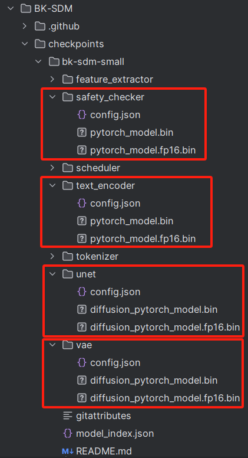
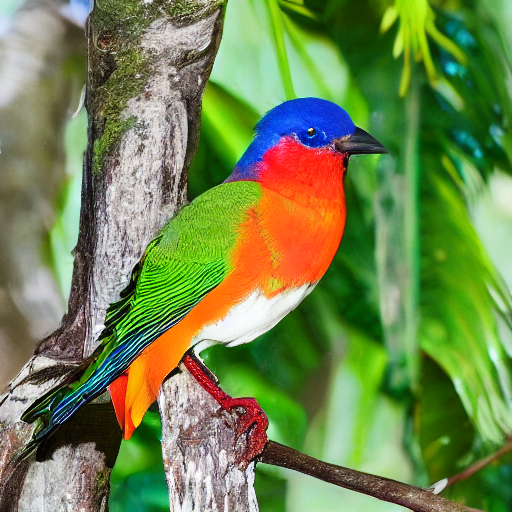
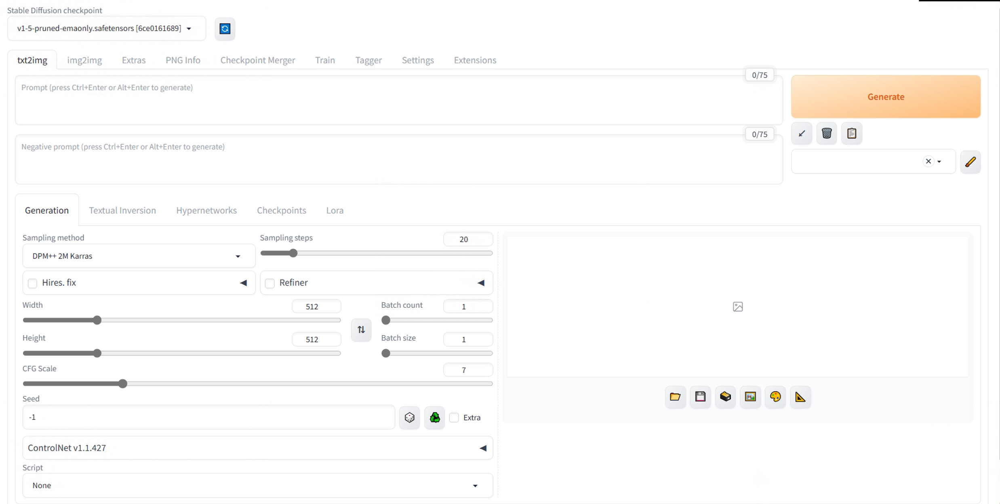
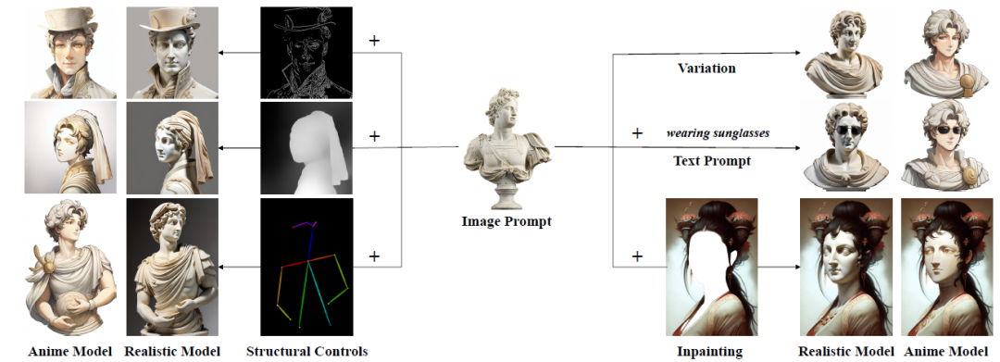
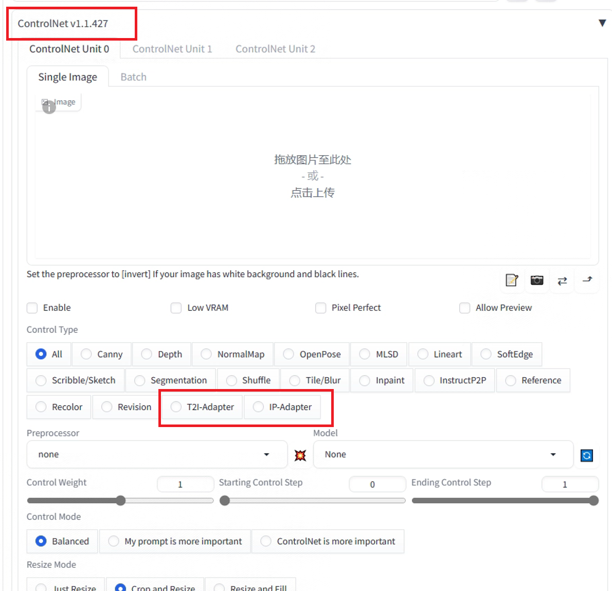
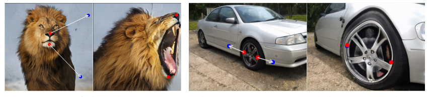

# 生成（Generation）

AIGC是生成式AI创造力的核心，涉及文本、图像、视频、代码、3D模型等内容的生成。文本生成在教育、法律和对话业务中有广泛应用；图像、视频和3D模型已在营销、影视创作和游戏等领域开花结果。对于大家来说AI绘画是大家最常接触的领域，目前的主流是 Stable diffusion 和 Midjourney 。Midjourney 开箱即用，对新手非常友好，但不免费，Stable diffusion 相对 Midjourney 来说，专业性更强，不易上手，但更灵活，模型生态丰富。此文档将主要介绍Stable diffusion的使用以及如何整合其他的模型一起使用。

## BK-SDM
如果显存有限，又只想快速的体验一下文生图的模型，这里有一个轻量级的基于知识蒸馏的“Stable Diffusion”，即“Block-removed Knowledge-distilled Stable Diffusion”
。([Github项目地址](https://github.com/Nota-NetsPresso/BK-SDM))，其small版本的模型只需要大概4G显存即可运行。
### 使用
进入BK-SDM文件夹，下载好[bk-sdm-small](https://hf-mirror.com/nota-ai/bk-sdm-small/tree/main)模型文件夹里的所有文件，放入创建的checkpoints里面，可以手动下载，把路径对应好 (除了比较大的.bin的模型文件，其他小文件我都手动下好了)。

这里主要是safety_checker，text_encoder，unet和vae这几个子文件夹下面还需要下载.bin的模型 （如果想运行“torch_dtype=torch.float16”版本的量化模型，才下载带.fp16.bin的模型，这个显存占用还要更小一点）。

 

根据自己的显存大小情况，如果还想用更小，或者大一些的模型，也可以按照类似的手段在[Nota AI的hugging face镜像](https://hf-mirror.com/nota-ai)自己下载tiny，或者base的模型文件夹。

也可以参考[huggingface](https://huggingface.co/)的镜像站[hf-mirror.com](https://hf-mirror.com/)下面的下载说明。

然后就可以运行BK-SDM文件夹下的demo.py了，比如prompt是”a tropical bird sitting on a branch of a tree“时，生成结果会是随机的这样子：
 

但也会生成看上去有点怪的，可能需要调一下prompts，以及多生成几次择优。

## Stable diffusion

这里推荐大家使用 Stable diffusion的Web UI ([项目地址](https://github.com/AUTOMATIC1111/stable-diffusion-webui))，操作更简单，整合其他的模型也更方便。

### 安装

Web UI的安装很简单，但是需要满足电脑具备英伟达显卡，任选项目主页所介绍的（Installation on Windows 10/11 with NVidia-GPUs using release package 和Automatic Installation on Windows）一种方法进行安装，如果安装成功，便会出现如下页面。包括文生图、图生图等基本的功能，通过输入提示词生成相应的图片。

## Lora

是一种体积较小的绘画模型，是对大模型的微调。与每次作画只能选择一个大模型不同，lora模型可以在已选择大模型的基础上添加一个甚至多个，基础的SD模型和Lora相结合可以实现很惊艳的图像输出。C站开源了很多训练好的SD模型和Lora模型，大家可以去上面探索一番，具体的操作方法可以参考这篇[博客: Stable Diffusion-webUI ckpt模型、lora模型的区别和使用](https://blog.csdn.net/qq_43223007/article/details/130249135)。

## ControlNet

ControlNet 的作用是通过添加额外控制条件，来引导 Stable Diffusion 按照创作者的创作思路生成图像，从而提升 AI 图像生成的可控性和精度。可以通过边缘、动作和深度图等等对输出图像进行控制，以下是一些效果图。

#### ControlNet安装

ControlNet安装有两种方式，第一种是独立的项目安装，[ControlNet项目地址](https://github.com/lllyasviel/ControlNet)，按照README中的说明下载预训练的ControlNet模型，创建相应的虚拟环境。第二种是整合在Stable diffusion的Web UI中使用，sd-web-ui-controlnet[项目地址](https://github.com/Mikubill/sd-webui-controlnet)，按照README中的Installation，将ControlNet配置到SD的Web UI中，完成配置后需要下载预训练好的ControlNet模型放入项目中的controlnet文件夹，便可以在生成图片时利用ControlNet对输出图片进行控制，更详细的说明和操作方法可以参考这篇[文章](https://zhuanlan.zhihu.com/p/646913973)。

### IP Adapter

IP Adapter是腾讯lab发布的一个新的Stable Diffusion适配器，它的作用是将输入的图像作为图像提示词，本质上就像MJ的垫图。下图总结了IP Adapter的几个基本用法。根据[项目地址](https://github.com/tencent-ailab/IP-Adapter)介绍配置环境，下载好需要的模型，运行示例的.ipynb文件。IP Adapter已经整合到了ControlNet中，按照之前的介绍中在Web UI中配置好ControlNet后，就可以直接使用。

### AnimateDiff

前面介绍的所有模型都是只能生成图片，AnimateDiff是一个即插即用的动画插件，通过该插件Stable diffusion可以生成动画([项目地址](https://github.com/guoyww/AnimateDiff))，按照项目介绍配置相应的虚拟环境，即可运行Gradio Demo，实现通过提示词生成动画。

AnimateDiff也可以整合到Stable diffusion中，在Stable diffusion的“扩展（extensions）”菜单，选择“可用（available）”，点击“加载自（load from）”，搜索“animatediff”，点击“安装（install）。更详细的安装和使用细节可以参考[这篇文章](https://zhuanlan.zhihu.com/p/680566781)。

## DragGAN

DragGAN 是一种用于直观基于点的图像编辑的交互方法([项目地址](https://github.com/XingangPan/DragGAN))，按照项目主页的介绍的配置方法，完成配置后运行DragGAN GUI，即可通过简单的拖动点实现图像的编辑。

以上介绍的项目只是AI用于生成的冰山一角，还有更多有趣的应用值得去探索，推荐大家可以去访问[huggingface](https://huggingface.co/spaces))，这里面有很多可以在线运行的Demo，可以供大家尝试。
