# 大语言模型 (Large Language Model)

在人工智能与创新设计深度融合的时代，大模型的兴起正重塑设计行业的创新范式，并对学习、生活和生产带来了巨大影响。

## Deepseek
### 接原厂API：
Deepseek作为开源大模型，很多其他大厂也都有部署，既可以直接使用原厂深度求索公司的deepseek[API部署教程](https://api-docs.deepseek.com/zh-cn/)，又可以使用诸如[字节的火山引擎](https://console.volcengine.com/ark)，[阿里的](https://help.aliyun.com/zh/pai/use-cases/one-click-deploy-deepseek)等等。

以下以使用原厂deepseek[API部署教程](https://api-docs.deepseek.com/zh-cn/)为例，首先你需要创建、登录自己的deepseek账号，点击这个界面下的‘apply for an API key’

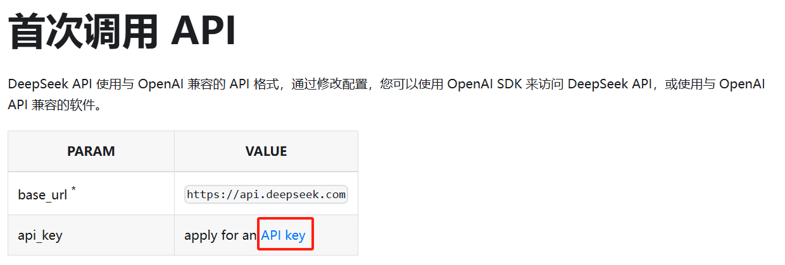

然后创建好API key，随便取个名字）比如图中的yyf_ds_api

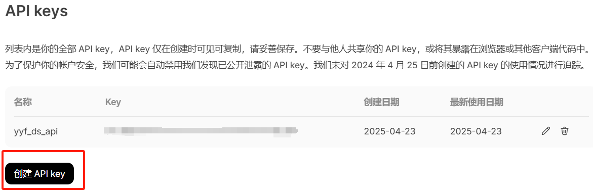

再次强调一遍，这个API key不要让其他人知道（除非你自己愿意），否则别人可以用这个API消耗你的钱，相当于别人偷偷接了你的电表=-=

然后，最好直接把API key写到自己的环境变量里，这样运行的代码也不会直白的给出完整的API key，进一步减少了泄露的风险，可参考阿里百炼平台的[配置教程](https://help.aliyun.com/zh/model-studio/developer-reference/configure-api-key-through-environment-variables#e4cd73d544i3r)。

比如跟我和官方一样，配置的时候取名为'DeepSeek_API_Key'(跟示例代码里保持一致)：

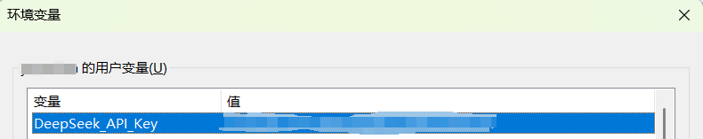

接着，就是用轻松愉快的用python调用deepseek大模型的API了，可以进入LLM文件夹，直接运行```deepseek.py```

问deepseek-chat（也就是DeepSeek-V3）“你好，你是谁？9.11和9.8哪个更大?”的话，我的测试回答如下：

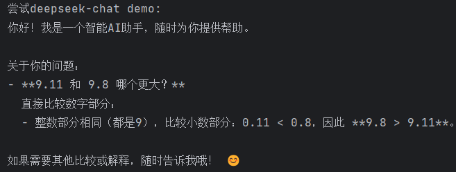

但如果问deepseek-reasoner（也就是DeepSeek-R1）的话，我的测试回答中，推理部分如下：

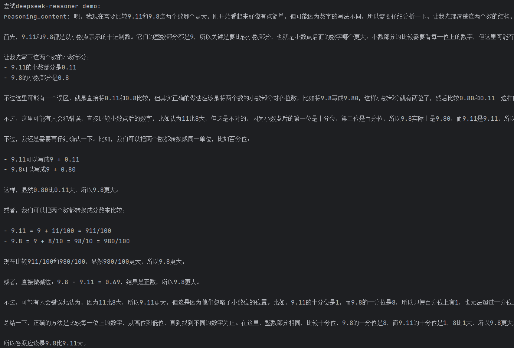

基于推理，正文的回答如下：（** 之间括起来的内容其实就是markdown形式中的**加粗**）

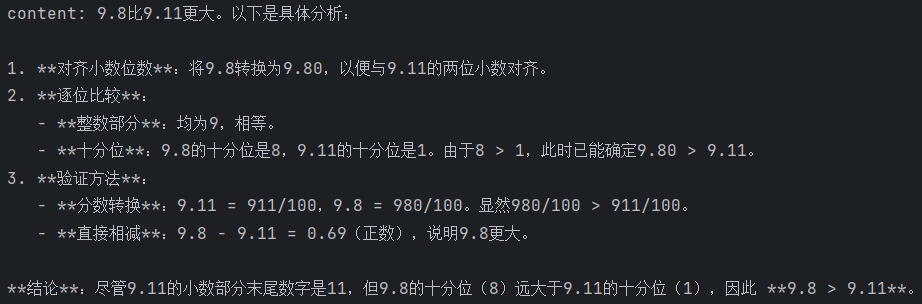

### 大模型用于NLP相关应用：

以及，大模型除了对话功能，还可以直接零/少样本的做到许多放以前都是要专门去训练的自然语言处理领域的任务，比如翻译、文字润色、多粒度情感分类等，这类案例可以观察和运行```deepseek_applications.py```

比如，针对这类系统提示词和用户提示词（[关于这两种提示词](https://blog.csdn.net/weixin_37251044/article/details/145001712)），
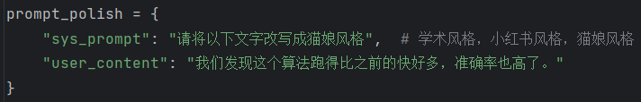

我测试的结果如下（大语言模型是概率模型，不同次的运行可能会出现不同的结果，也跟[Temperature设置](https://api-docs.deepseek.com/zh-cn/quick_start/parameter_settings)有关，关于温度系数，可[参考资料](https://zhuanlan.zhihu.com/p/666670367)：

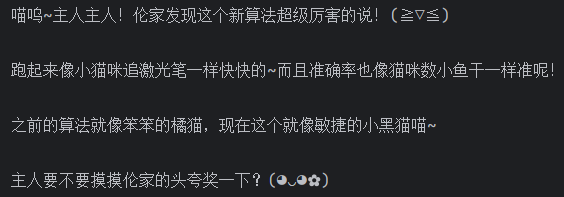

## 使用其他厂的大模型（包括Deepseek）

### 其他厂的deepseek

Deepseek是开源的大模型，意味着只要有足够的卡和资源，就可以在本地部署，但是我们正常人肯定部署不了满血版ds，所以也可以接一些大厂部署的deepseek API（如果原厂有时候太慢或者你觉得太贵），比如字节跳动的[火山引擎](https://console.volcengine.com/ark)里的deepseek。

可从[https://console.volcengine.com/ark](https://console.volcengine.com/ark)中，找到模型广场

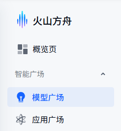

找到Deepseek-R1，或者任何其他你想运行的模型，立即体验

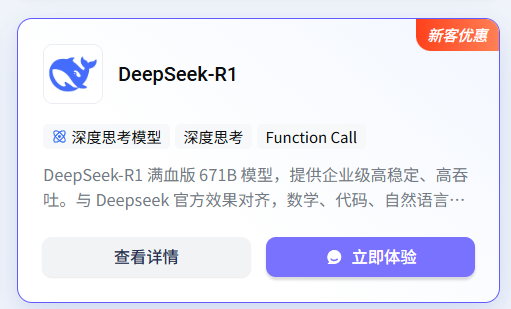

中间上方可以点击API接入

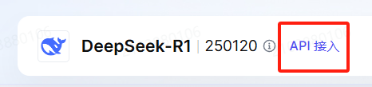

然后类似的，按照他的教程配置属于火山引擎的API Key就行了

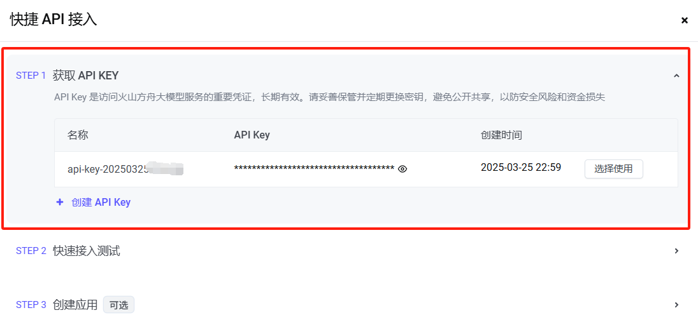

同样的，把大模型的API Key配置到环境变量里去，[参考教程](https://help.aliyun.com/zh/model-studio/developer-reference/configure-api-key-through-environment-variables#e4cd73d544i3r),我的环境变量名字是Huoshan_API_Key

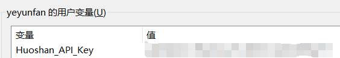

然后就可以跑```deepseek_huoshan.py```了

### 一些免费的模型

如果一点值也不想充，也可以考虑部分大厂提供的免费模型，但是账号和API Key还是要自己弄的，比如腾讯混元中，hunyuan-lite就是免费调用的，详情可参考[混元模型计费](https://cloud.tencent.com/document/product/1729/97731)，阿里的[千问模型计费](https://help.aliyun.com/zh/model-studio/models?spm=a2c4g.11186623.0.0.4fd51e19GHFdUT)等（免费模型效果有限）。

可以试试配置好腾讯混元的**HUNYUAN_API_KEY**，运行```deepseek_hunyuan.py```

## 开源LLM WebUI框架

可参考[Github开源AI LLM大语言模型WebUI框架推荐](https://promptchoose.com/ai-tools/github-open-source-llm-webui-framework/), 包括

Open WebUI: https://github.com/open-webui/open-webui

Dify: https://github.com/langgenius/dify

...

## MCP (Model Context Protocol)

MCP 是一种开放协议，通过标准化的服务器实现，使 AI 模型能够安全地与本地和远程资源进行交互。

MCP相关原始文档：

https://www.anthropic.com/news/model-context-protocol

https://modelcontextprotocol.io/introduction

MCP相关中文介绍：

https://blog.csdn.net/fufan_LLM/article/details/146377471

https://zhuanlan.zhihu.com/p/29001189476

https://www.bilibili.com/video/BV18wdUYwEYk

MCP Servers：

https://github.com/punkpeye/awesome-mcp-servers/blob/main/README-zh.md 

https://mcpservers.org/ 

https://github.com/modelcontextprotocol/servers

...

