# 环境配置

## 参考资料 
（最好先都看看这样心里有个大概。资料很多，这里只是举个例子给个参考，碰到具体问题具体再搜）

先自己把PyCharm装好：[安装PyCharm CSDN](https://blog.csdn.net/Z987421/article/details/131422753)和[安装PyCharm 知乎](https://zhuanlan.zhihu.com/p/361386599)

[anaconda的安装和使用](https://blog.csdn.net/tqlisno1/article/details/108908775)

[更换pip源](https://zhuanlan.zhihu.com/p/127275233)

[Conda命令相关](https://blog.csdn.net/miracleoa/article/details/106115730)


## 图文步骤
先去到anaconda的官网: [https://www.anaconda.com/download](https://www.anaconda.com/download),点击Download下载

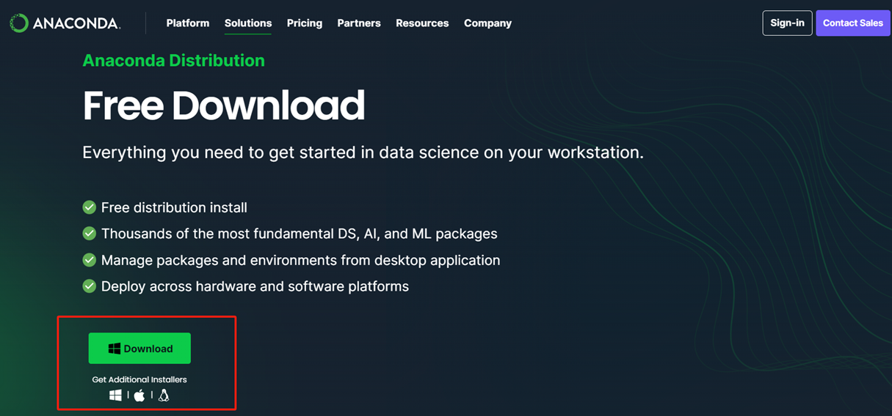

下载好后双击准备安装 （此安装包在全部装好后可以删掉）

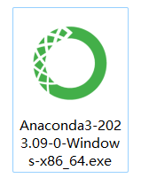

接下来正常点Next，这里为了省事就选just me吧

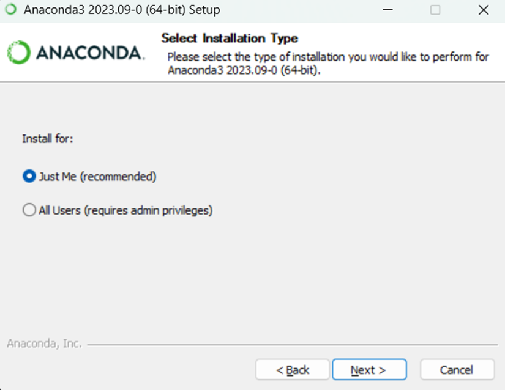

找个空间大点的地方装（因为还要装虚拟环境和各种python库）， 路径最好不要有中文和空格，如果自定义了路径，那么选好地方后记得**重新手动补一下\anaconda3这个文件夹路径**

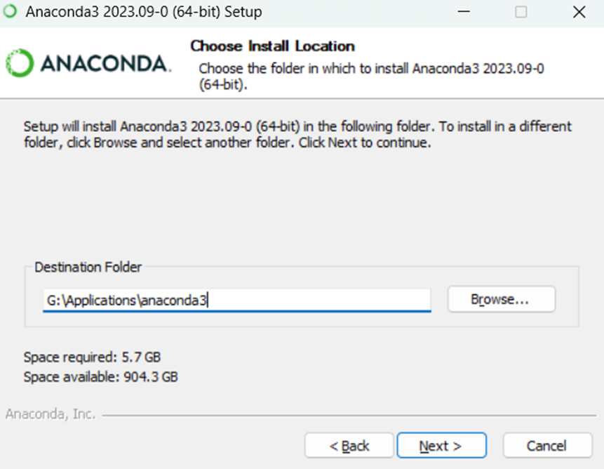

同样，如果是第一次装，为了省事，可以把“add… varariable”勾上， 这样就不用再自己去添加环境变量了（如果要自己添加，可以参考[资料](https://zhuanlan.zhihu.com/p/653767179)），下面的clear cache也可以勾

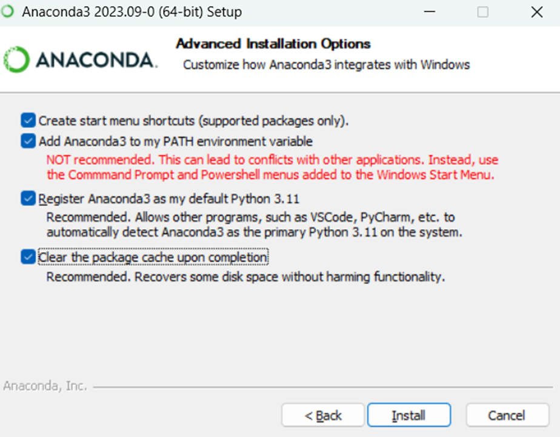

经过一段时间的等待安装（可以去翻翻本文档的其他内容），不出意外的话就装好了。

接下来，按键盘上的Windows键（左下角Alt旁边的）+R，输入cmd打开命令行

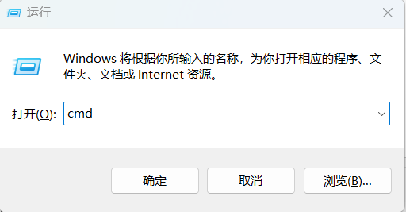

输入```conda env list```看下环境，确实装上了就会像这样（如果不行，可能是conda没加到环境变量里去）

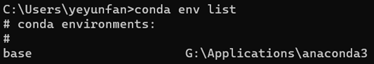

输入```conda create -n pytorch python=3.8```创建名为“pytorch的”新环境，其中包含了3.8版本的python，安装的时候根据提示输入y即可（3.8是测试下来能兼容较多项目的版本）

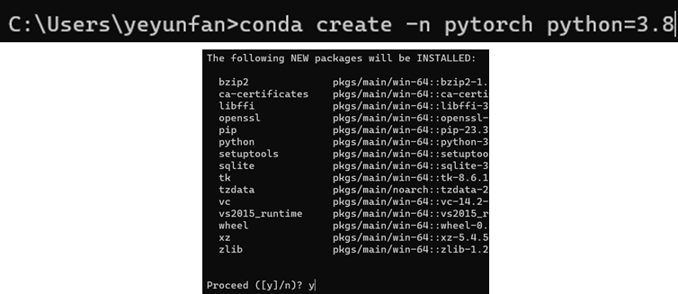

按照提示，输```conda activate pytorch```，可以进入刚创的名为pytorch的环境

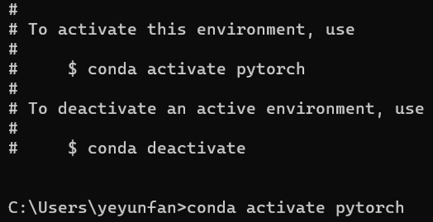

接下来便可以按项目需求安装包了，pip –V可以看到将会安装到的路径 (这个路径是python库的下载位置，pycharm中创建的项目位置和包的位置没关系)

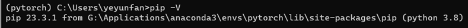

进PyCharm创好新项目后，找到这个设置的小图标，点Settings进去（新版PyCharm设置的位置在右上角）

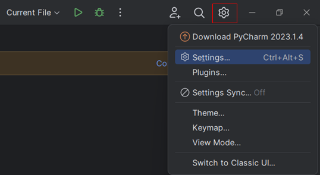

找到python interpreter，add interpreter，add local interpreter

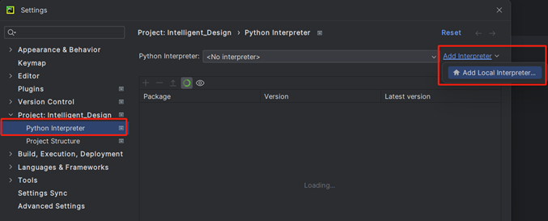

Environment选existing，然后找到咱刚创建的conda新环境 （…… anaconda3\envs\pytorch ） 选中后一路OK，Apply

这样就可以用这个环境运行对应的python代码了

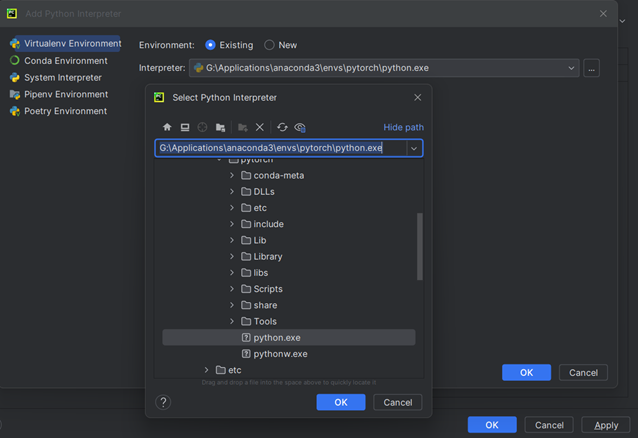